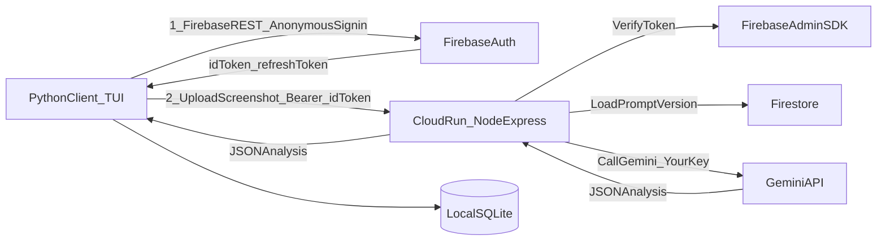

# Telos Beta Plan (Firebase + Cloud Run, Node backend)

## Locked decisions

- **Backend**: `telos-backend` (Node.js + Express) deployed to **Cloud Run**.
- **Auth**: **Firebase Auth**, used from the Python client via **REST APIs**.
- Start with **Anonymous sign-in** for zero-friction trial.
- Later: **link anonymous → Email/Password** to collect emails without losing data.
- **Token storage (beta)**: client stores Firebase `idToken` + `refreshToken` in `~/.telos/auth.json`.
- **Gemini calls**: **server-side** (backend calls Gemini using **your** key). Prompts remain private.
- **Prompts**: served/managed only on backend (store in Firestore; backend returns only JSON results).
- **Beta product posture**: **all features unlocked**, optimize for learning + iteration; freemium limits later.
- **Data storage (beta)**: **Local-first** - all user activity data stays in local SQLite. Cloud sync is a future Pro feature.

## High-level architecture

## Phase 0: Cloud/Firebase project setup

- Enable **Firebase Auth** providers:
- Anonymous
- Email/Password
- Create **Firestore** database.
- Record **Firebase Web API Key** (needed for Auth REST from Python).
- Create **Secret Manager** secret for `GEMINI_API_KEY`.
- (Strongly recommended) Set **GCP Budget + Alerts** for the project.

## Phase 1: Backend MVP (`telos-backend`) on Cloud Run

### Backend MVP goals

- Provide one working endpoint that returns the same JSON your client expects today.
- Do not store screenshots; process in-memory and discard.

### Endpoints (MVP)

- `POST /v1/analyze/screenshot`
- Auth: `Authorization: Bearer <FirebaseIdToken>`
- Body: `multipart/form-data` with screenshot field (e.g. `image`)
- Returns: analysis JSON (category/app/task/confidence/detailed_context/category_emoji/category_color)

### Firestore collections (starter)

- `prompts/{promptName}` → `{ activeVersion: "v1", updatedAt }`
- `prompt_versions/{promptName}/versions/{version}` → `{ content, createdAt }`
- `users/{uid}` → `{ email, createdAt, lastSeenAt, betaFlags }` (email may be null until linked)
- `usage/{uid}` → counters for abuse prevention (even in beta)

### Security/abuse controls (MVP)

- Verify Firebase ID tokens with Firebase Admin.
- Rate limit per `uid` / per IP.
- Never log request bodies or image bytes.

## Phase 2: Client MVP changes (this repo)

### Auth in Python via Firebase REST

Implement:

- Anonymous sign-in: `accounts:signUp`
- Refresh token: `securetoken.googleapis.com/token`
- Persist tokens to `~/.telos/auth.json`

### Proxy analysis via backend

- Replace direct Gemini calls in the capture loop with:
- Upload screenshot to backend
- Receive JSON analysis
- Insert into local SQLite (same as today)

### Onboarding UX (beta)

- First run:
- Explain privacy + what is uploaded during beta
- Ask for goals/intention preset
- Start tracking immediately
- After user sees value:
- Prompt: “Create account to sync/save (email)” (deferred)

### Email capture (later, still beta)

- Add “Create account” screen to link anonymous to Email/Password.
- Mirror email to Firestore `users/{uid}` for easy querying.

## Phase 3: Deployment workflow (how you manage it)

### Repos

- Client repo: current (`telos` / screentracker)
- Backend repo: `telos-backend`

### Environments

- **Local dev**: backend at `http://localhost:xxxx`, client points to it.
- **Prod/beta**: backend on Cloud Run (HTTPS URL), client default config points there.

### Versioning rule of thumb

- Client and backend communicate through a stable, versioned API: `/v1/...`
- If you change responses, bump API version or keep backward compatibility.

## Phase 4: Later (when you're ready)

- Add freemium limits.
- Allow users to add their own Gemini key **but still use backend calls** (to keep prompts private): backend calls Gemini with user key stored encrypted.
- Add web dashboard + richer sync.
- **Cloud data sync (Pro feature)**: Opt-in cloud storage of user's activity data in Firestore for cross-device sync and backup. Beta keeps all data local-only.

## Implementation todos (in order)

- **firebase-project-setup**: Enable Auth providers, Firestore, collect Web API Key, set budget alerts.
- **backend-mvp-express**: Create `telos-backend` Node/Express service with `/v1/analyze/screenshot`.
- **client-version-check**: Backend returns minimum required client version; outdated clients show update message.
- **backend-auth-verify**: Verify Firebase tokens with Admin SDK; add basic rate limiting and log redaction.
- **define-beta-quotas**: Define and implement beta rate limits (2000/day, 100/hour per user).
- **backend-gemini-call**: Call Gemini with server key from Secret Manager; return strict JSON.
- **backend-cloudrun-deploy**: Deploy to Cloud Run, configure secrets/env/permissions.
- **backend-monitoring**: Set up Cloud Logging, Error Reporting, and monitoring dashboard.
- **client-firebase-auth-rest**: Add Firebase REST anonymous sign-in + token refresh + `~/.telos/auth.json` storage.
- **client-proxy-analysis**: Upload screenshot to backend + store returned analysis in SQLite.
- **client-fallback-mode**: Implement graceful degradation with local Gemini fallback when backend unavailable.
- **client-onboarding-beta**: Add onboarding flow + delayed "create account" prompt.
- **client-email-linking**: Implement anonymous→email linking and Firestore storage.