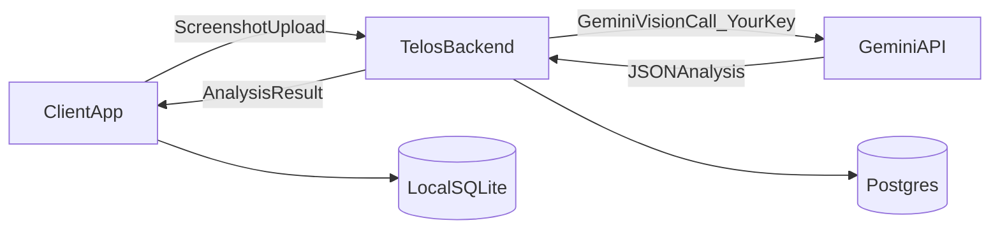

# Telos Beta Plan (No-Key Trial, Proprietary Prompts)

## What you want (restated)

- **Minimal onboarding friction**: user can try Telos immediately, terminal-first.
- **All features unlocked initially**: optimize learning + iterate quickly.
- **Prompts/logic stay private**: users should not see or edit prompts.
- **Later**: enforce free-tier limits, then allow users to add their own Gemini key to keep going.
- **Windows + macOS**: both should work.

## Key decision

To avoid asking users for a Gemini key on day 1 **and** keep prompts private, the backend must do the Gemini Vision call.

## Phase A: MVP Beta Architecture (fast to ship)

### A1) Client responsibilities

- Capture screenshots locally (existing).
- Upload screenshot bytes to backend over HTTPS.
- Receive structured analysis result JSON.
- Store results locally (SQLite) + run the TUI.
- background sync of captures/sessions/summaries to cloud.

### A2) Backend responsibilities (your secret sauce)

- Authenticate client - email login - need to collect the emails as well
- Store prompts and version them (private).
- Run Gemini Vision using **your server-side key**.
- Enforce rate limits + abuse controls.
- Return only the JSON analysis (and never return prompts).
- **Do not store screenshots**: stream process in-memory and delete immediately.

## Phase B: Onboarding flow (minimal friction)

### B1) First run

- `telos` launches a short guided wizard in TUI/CLI:
- Privacy explanation (what’s captured, what’s uploaded during beta)
- Permission help (macOS ScreenRecording + Accessibility)
- Pick intention/goals (preset)
- Start tracking

### B2) “No account required” beta

- On first run, client requests an **anonymous token** from backend.
- User can optionally “Upgrade to account” later (email login) to enable multi-device sync.

## Phase C: Deployment options (beginner-friendly)

### Option 1 (recommended for you): Managed PaaS

**Railway / Render / Fly.io**

- You push code to GitHub → it auto-deploys.
- You attach a managed Postgres database.
- SSL/HTTPS is handled.
- Easiest path for a solo builder.

### Option 2: Google Cloud Run (serverless containers)

- Scales to zero, pay-per-use.
- Slightly more setup than PaaS.
- Great once you need scale and tighter control.

### Option 3: VPS (DigitalOcean/AWS EC2)

- Most flexible, most ops work.
- You manage updates, process manager, TLS, monitoring.
- Not ideal for your “learn while shipping” stage.

## Phase D: Privacy/security items you must be mindful about

Because screenshots are sensitive:

- **Explicit consent** in onboarding that screenshots are uploaded during beta.
- **No storage**: stream screenshot → Gemini → discard.
- **Minimal logging**: never log image bytes; redact payloads.
- **Rate limiting** and abuse prevention.
- **Data retention controls** for synced metadata.
- Terms/Privacy Policy before broad distribution.

## Phase E: Later transition to freemium + user-provided key

When you’re ready:

- Add limits (captures/day, chat queries/day).
- Allow user to add their own Gemini key:
- **Still server-side** (to keep prompts private): backend uses the user’s key (encrypted at rest) to call Gemini.
- Or offer “local mode” later (but then prompts are harder to keep secret).

## Implementation order (practical)

1. **Backend MVP**: anonymous auth + `POST /analyze-screenshot` endpoint + prompt store/versioning.
2. **Client changes**: upload screenshot → consume analysis result (swap local analyzer call).
3. **Packaging**: `telos` terminal command via pip + simple installer docs.
4. **macOS support**: permissions helper + launchd background agent (optional for beta, but recommended).
5. **Telemetry**: basic opt-in event stats to learn what users do.
6. **Account + sync**: email login + cloud sync once you have early traction.
7. **Billing**: Stripe only after product signal.

## Files likely to change (client repo)

- [`core/analyzer.py`](core/analyzer.py): replace Gemini direct call with backend call (beta mode).
- [`main.py`](main.py): onboarding flow updates.
- [`tui/screens/`](tui/screens/): welcome/onboarding/permissions.
- `setup.py` (or modern `pyproject.toml`): create `telos` CLI entrypoint.

## New backend repo (separate)

- `telos-backend/` (FastAPI)
- `POST /v1/devices/register`
- `POST /v1/analyze/screenshot`
- `GET /v1/prompts/{name}` (internal/admin)
- Admin-only prompt editor (simple)

---

## Todos

- **backend-mvp**: FastAPI backend with anonymous device auth + screenshot analyze endpoint
- **prompt-store**: Prompt/version storage + admin-only edit endpoint
- **client-proxy-analyze**: Client uploads screenshots to backend and stores returned analysis
- **onboarding-beta**: Minimal-friction onboarding with privacy + goals + permissions guidance
- **packaging-cli**: `telos` terminal command + install docs (Windows + macOS)