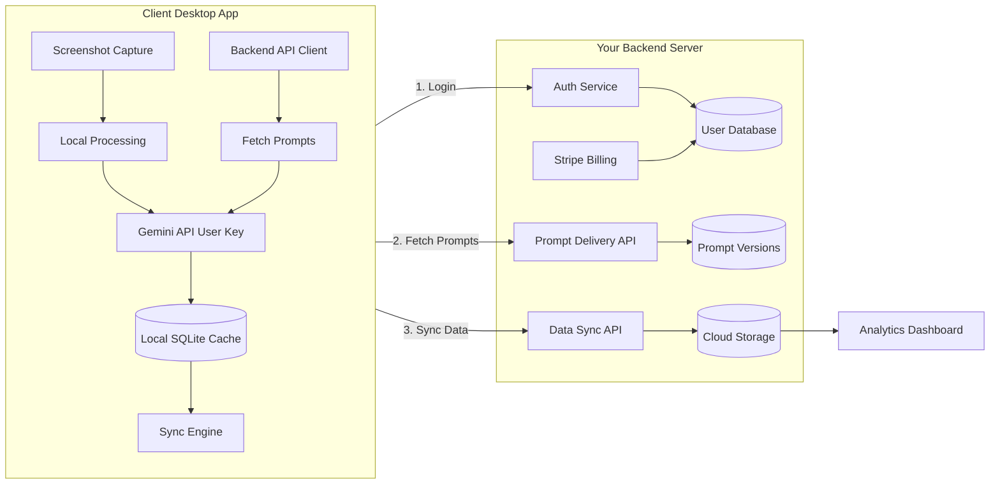

# Telos SaaS Architecture Plan

## Overview

Build a hybrid client-server architecture where screenshots and AI processing stay local (privacy-first), but prompts, intelligence logic, and data storage are cloud-based. This lets you iterate on the AI system continuously while users automatically benefit from improvements.

## Core Architecture




## Phase 1: Backend Infrastructure

### 1.1 Technology Stack

**Backend Framework**: FastAPI (Python, fast, async, auto-docs)**Database**: PostgreSQL (user data, prompts, captures)**Authentication**: JWT tokens + refresh tokens**Storage**: PostgreSQL for structured data + S3 for backups (optional)**Deployment**: Railway, Render, or AWS**Payment**: Stripe for subscriptions

### 1.2 Database Schema (Backend)

**users table**:

- `id` (UUID)
- `email` (unique)
- `password_hash` (bcrypt)
- `subscription_tier` ('free' | 'premium')
- `stripe_customer_id`
- `gemini_api_key_encrypted` (user's API key, encrypted at rest)
- `created_at`, `last_login`

**prompts table**:

- `id` (UUID)
- `name` ('screenshot_analysis' | 'session_enrichment' | 'daily_summary' | 'ai_chat')
- `version` (semver: '1.0.0', '1.1.0')
- `content` (full prompt text)
- `tier` ('free' | 'premium') - which tier can access
- `active` (boolean)
- `created_at`, `updated_at`

**user_captures table** (synced from client):

- `id` (UUID)
- `user_id` (FK)
- `timestamp`
- `category`, `app_name`, `task`, `confidence`
- `detailed_context` (JSON)
- `synced_at`

**user_sessions table** (synced from client):

- Similar structure to local sessions table
- Includes `user_id` FK

**user_summaries table** (synced from client):

- Daily summaries with `user_id` FK

### 1.3 Backend API Endpoints

**Authentication**:

- `POST /api/v1/auth/register` - Create account
- `POST /api/v1/auth/login` - Login (returns JWT + refresh token)
- `POST /api/v1/auth/refresh` - Refresh access token
- `GET /api/v1/auth/me` - Get current user info
- `PUT /api/v1/auth/gemini-key` - Store/update user's Gemini API key (encrypted)

**Prompts** (your secret sauce):

- `GET /api/v1/prompts/{name}` - Get latest prompt version for user's tier
- `GET /api/v1/prompts/{name}/version/{version}` - Get specific version
- Headers: `Authorization: Bearer <jwt_token>`

**Data Sync**:

- `POST /api/v1/sync/captures` - Upload captures (batch)
- `POST /api/v1/sync/sessions` - Upload sessions (batch)
- `POST /api/v1/sync/summaries` - Upload summaries
- `GET /api/v1/sync/captures?since=<timestamp>` - Download recent captures
- `GET /api/v1/sync/sessions?since=<timestamp>` - Download sessions
- `GET /api/v1/sync/summaries?since=<timestamp>` - Download summaries

**Subscription**:

- `GET /api/v1/subscription/status` - Current subscription status
- `POST /api/v1/subscription/checkout` - Create Stripe checkout session
- `POST /api/v1/subscription/portal` - Stripe customer portal link
- `POST /api/v1/webhooks/stripe` - Stripe webhook handler

**Analytics** (for you):

- `GET /api/v1/admin/stats` - User stats, active users, API usage
- Dashboard to see usage patterns, popular features

### 1.4 Backend File Structure

```javascript
telos-backend/
├── main.py                    # FastAPI app entry point
├── requirements.txt
├── .env                       # Environment variables
├── alembic/                   # Database migrations
│   └── versions/
├── app/
│   ├── __init__.py
│   ├── config.py              # Settings (database URL, JWT secret, etc.)
│   ├── database.py            # SQLAlchemy setup
│   ├── models/                # Database models
│   │   ├── user.py
│   │   ├── prompt.py
│   │   ├── capture.py
│   │   └── subscription.py
│   ├── schemas/               # Pydantic schemas (API validation)
│   │   ├── auth.py
│   │   ├── prompt.py
│   │   └── sync.py
│   ├── api/
│   │   ├── v1/
│   │   │   ├── auth.py        # Auth endpoints
│   │   │   ├── prompts.py     # Prompt delivery
│   │   │   ├── sync.py        # Data sync endpoints
│   │   │   └── subscription.py# Billing endpoints
│   ├── services/
│   │   ├── auth_service.py    # JWT creation, password hashing
│   │   ├── prompt_service.py  # Prompt versioning logic
│   │   ├── sync_service.py    # Sync conflict resolution
│   │   └── billing_service.py # Stripe integration
│   └── utils/
│       ├── encryption.py      # Encrypt user Gemini API keys
│       └── security.py        # JWT validation, rate limiting
└── tests/
```


## Phase 2: Client Modifications

### 2.1 Authentication Module

Create [`core/auth.py`](core/auth.py):

- `login(email, password)` - Returns JWT tokens
- `register(email, password, gemini_api_key)` - Create account
- `refresh_token()` - Refresh access token
- `get_current_user()` - Get user info
- `is_authenticated()` - Check if logged in
- `logout()` - Clear tokens

Store tokens in: `~/.telos/auth.json` (or system keychain for extra security)

### 2.2 Backend API Client

Create [`core/backend_client.py`](core/backend_client.py):

```python
class TelosBackendClient:
    def __init__(self, base_url, auth_token):
        self.base_url = base_url
        self.auth_token = auth_token
    
    def fetch_prompt(self, prompt_name: str) -> str:
        """Fetch latest prompt from backend"""
        response = requests.get(
            f"{self.base_url}/api/v1/prompts/{prompt_name}",
            headers={"Authorization": f"Bearer {self.auth_token}"}
        )
        return response.json()['content']
    
    def sync_captures(self, captures: list):
        """Upload captures to cloud"""
        # Batch upload with retry logic
        pass
    
    def sync_sessions(self, sessions: list):
        """Upload sessions to cloud"""
        pass
    
    def get_subscription_status(self):
        """Check if user is premium"""
        pass
```


### 2.3 Dynamic Prompt Loading

Modify [`core/analyzer.py`](core/analyzer.py):**Current**: Loads prompts from local files (`prompts/screenshot_analysis.txt`)**New**:

```python
class GeminiAnalyzer:
    def __init__(self, api_key, model, backend_client=None):
        self.api_key = api_key
        self.model = model
        self.backend_client = backend_client
        self.prompt_cache = {}  # Cache for session
    
    def get_prompt(self, prompt_name: str) -> str:
        """Fetch prompt from backend or use cached version"""
        if not self.backend_client:
            # Fallback to local prompts (offline mode)
            return self._load_local_prompt(prompt_name)
        
        # Check cache (valid for current session)
        if prompt_name in self.prompt_cache:
            return self.prompt_cache[prompt_name]
        
        # Fetch from backend
        try:
            prompt = self.backend_client.fetch_prompt(prompt_name)
            self.prompt_cache[prompt_name] = prompt
            return prompt
        except Exception as e:
            # Fallback to local or cached
            return self._load_local_prompt(prompt_name)
```

Similar changes for:

- [`core/session_builder.py`](core/session_builder.py) - Fetch session enrichment prompts
- [`core/daily_aggregator.py`](core/daily_aggregator.py) - Fetch summary prompts
- [`core/query_engine.py`](core/query_engine.py) - Fetch AI chat prompts

### 2.4 Data Sync Engine

Create [`core/sync_engine.py`](core/sync_engine.py):

```python
class SyncEngine:
    """Handles bidirectional sync between local SQLite and cloud"""
    
    def __init__(self, db: Database, backend_client: TelosBackendClient):
        self.db = db
        self.backend_client = backend_client
        self.last_sync = self._load_last_sync_time()
    
    async def sync_all(self):
        """Sync all data types"""
        await self.sync_captures_up()
        await self.sync_sessions_up()
        await self.sync_summaries_up()
        # Optional: Pull from cloud for multi-device
        await self.sync_captures_down()
    
    async def sync_captures_up(self):
        """Upload new captures to cloud"""
        unsynced = self.db.get_unsynced_captures()
        if unsynced:
            self.backend_client.sync_captures(unsynced)
            self.db.mark_captures_synced([c['id'] for c in unsynced])
```

Add sync worker to TUI: [`tui/workers/sync_worker.py`](tui/workers/sync_worker.py)

- Runs every 5 minutes
- Uploads new data to cloud
- Shows sync status in UI

### 2.5 Offline Mode Support

Local prompts as fallback:

- Keep [`prompts/`](prompts/) folder with "base" versions
- If backend unreachable, use local prompts
- Show warning in TUI: "Offline mode - using cached prompts"

## Phase 3: Onboarding & Authentication UI

### 3.1 Login/Register Screen

Create [`tui/screens/auth.py`](tui/screens/auth.py):

- **Login form**: Email + password
- **Register form**: Email + password + confirm password + Gemini API key
- **Forgot password** (optional for MVP)
- Beautiful TUI design (Textual forms)

### 3.2 Setup Wizard (New User Flow)

Update [`main.py`](main.py) setup command:**Step 1: Welcome**

- "Welcome to Telos!"
- "Privacy-first AI activity tracker"

**Step 2: Account Creation**

- "Create your Telos account"
- Email + password
- "Your data syncs across devices but stays private"

**Step 3: Gemini API Key**

- "Telos uses your Gemini API key"
- Link to get key: https://aistudio.google.com/app/apikey
- Validate key by making test API call
- Stored encrypted on backend

**Step 4: Choose Analysis Goals**

- Productivity, Learning, Project Tracking, Habits

**Step 5: Optional - Email Reports**

- Configure email settings (can skip)

**Step 6: Install Background Service**

- Windows: Install Windows Service
- Mac: Install launchd agent
- Option to skip (run manually)

**Step 7: Success**

- "You're all set!"
- "Run: telos"

### 3.3 Subscription Management Screen

Create [`tui/screens/subscription.py`](tui/screens/subscription.py):

- Show current tier (Free / Premium)
- Free tier limits: X captures/day, basic prompts
- Premium features: Unlimited, advanced AI prompts, priority support
- "Upgrade to Premium" button → Opens Stripe checkout in browser
- "Manage Subscription" → Opens Stripe customer portal

## Phase 4: Freemium Tier Logic

### 4.1 Free Tier Limits

**Free Tier**:

- 500 captures per month (≈16/day)
- Basic prompts (v1.0)
- Local storage only
- AI Chat: 10 queries per day
- No email reports

**Premium Tier** ($9-15/month):

- Unlimited captures
- Advanced prompts (latest versions with better insights)
- Cloud sync across devices
- AI Chat: Unlimited
- Email reports
- Priority support
- Early access to new features

### 4.2 Enforce Limits in Client

Modify [`tui/workers/capture_worker.py`](tui/workers/capture_worker.py):

```python
async def capture_loop(self):
    # Check subscription status
    sub_status = self.backend_client.get_subscription_status()
    
    if sub_status['tier'] == 'free':
        monthly_captures = self.db.get_monthly_capture_count()
        if monthly_captures >= 500:
            self.show_upgrade_prompt()
            return  # Pause capturing
    
    # Continue normal capture...
```

Show upgrade prompt in TUI: "You've reached the free tier limit. Upgrade to Premium for unlimited tracking!"

### 4.3 Backend Enforcement

Backend validates on each sync:

- Check user's subscription tier
- Reject sync if over limits
- Return error: `{"error": "Free tier limit exceeded", "upgrade_url": "..."}`

## Phase 5: Cross-Platform Support (Mac + Windows)

### 5.1 Platform-Agnostic Service

Same as previous plan:

- [`platform/service_manager.py`](platform/service_manager.py) - Detect OS
- [`platform/windows_service.py`](platform/windows_service.py) - Windows Service
- [`platform/macos_service.py`](platform/macos_service.py) - launchd agent

### 5.2 Mac Permissions

Screen Recording + Accessibility permissions with helper UI

### 5.3 pip Installation

Create [`setup.py`](setup.py) with entry point:

```python
entry_points={
    'console_scripts': [
        'telos=main:main',
    ],
}
```

Users install: `pip install git+https://github.com/AnuragKurle/telos.git`

## Phase 6: Deployment

### 6.1 Backend Deployment

**Option 1: Railway** (easiest, $5-10/mo)

- Connect GitHub repo
- Auto-deploy on push
- PostgreSQL included
- SSL certificates automatic

**Option 2: Render** (good free tier, then $7/mo)

- Free PostgreSQL (limited)
- Auto-deploy from GitHub

**Option 3: AWS/DigitalOcean** (more control, ~$15/mo)

- EC2/Droplet + RDS PostgreSQL
- More configuration required

### 6.2 Domain & SSL

- Buy domain: `telos.app` or similar
- Point API to: `api.telos.app`
- SSL certificates (automatic with Railway/Render)

### 6.3 Monitoring

- **Backend**: Sentry for error tracking
- **Client**: Optional telemetry (anonymized usage stats)
- **Analytics**: Track feature usage, popular prompts

## Phase 7: Prompt Management Dashboard

### 7.1 Admin Dashboard (Web)

Build simple admin panel (FastAPI + Jinja2 templates or React):

- **Prompts Page**:
- List all prompts (screenshot_analysis, session_enrichment, etc.)
- Edit prompt content in textarea
- Version management (create new version)
- Mark version as active
- Preview prompt before publishing
- **Users Page**:
- List users, subscription status
- Usage stats (captures/day, API calls)
- Manual subscription overrides
- **Analytics Page**:
- Active users (daily, weekly, monthly)
- Capture volume
- Popular features
- Subscription conversion rate

### 7.2 Prompt Versioning Workflow

1. Edit prompt in admin dashboard
2. Create new version (e.g., 1.0.0 → 1.1.0)
3. Test internally with your account
4. Mark as active for free/premium tier
5. All clients automatically get new version on next use
6. **No client updates needed!**

## Key Implementation Files

### New Backend Files (Separate Repo)

- `telos-backend/` - Entire backend codebase
- Deploy separately from client

### Modified Client Files

- [`core/auth.py`](core/auth.py) - NEW: Authentication
- [`core/backend_client.py`](core/backend_client.py) - NEW: API client
- [`core/sync_engine.py`](core/sync_engine.py) - NEW: Data sync
- [`core/analyzer.py`](core/analyzer.py) - MODIFY: Dynamic prompt loading
- [`core/session_builder.py`](core/session_builder.py) - MODIFY: Dynamic prompts
- [`core/daily_aggregator.py`](core/daily_aggregator.py) - MODIFY: Dynamic prompts
- [`core/query_engine.py`](core/query_engine.py) - MODIFY: Dynamic prompts
- [`tui/screens/auth.py`](tui/screens/auth.py) - NEW: Login/register screen
- [`tui/screens/subscription.py`](tui/screens/subscription.py) - NEW: Subscription management
- [`tui/workers/sync_worker.py`](tui/workers/sync_worker.py) - NEW: Background sync
- [`main.py`](main.py) - MODIFY: Enhanced setup wizard
- [`setup.py`](setup.py) - NEW: pip installation
- [`platform/`](platform/) - NEW: Cross-platform service support

## Development Timeline

### Phase 1: Backend MVP (1 week)

- FastAPI setup
- PostgreSQL schema
- Auth endpoints (register, login)
- Prompt delivery API
- Basic sync API
- Deploy to Railway

### Phase 2: Client Integration (4-5 days)

- Backend client module
- Dynamic prompt loading
- Authentication UI (TUI)
- Setup wizard with account creation
- Sync engine (basic)

### Phase 3: Freemium Logic (2-3 days)

- Tier enforcement client-side
- Tier enforcement backend
- Subscription screen in TUI
- Stripe integration

### Phase 4: Cross-Platform (3-4 days)

- Mac service implementation
- Mac permissions
- pip packaging
- Testing on both platforms

### Phase 5: Admin Dashboard (2-3 days)

- Prompt management UI
- User management
- Basic analytics

### Phase 6: Polish & Testing (3-4 days)

- Error handling
- Offline mode
- Documentation
- Beta testing

**Total: 3-4 weeks for full implementation**

## Revenue Projections

### Pricing Strategy

- **Free**: 500 captures/month (~16/day)
- **Premium**: $12/month or $99/year (save 30%)

### Target Metrics

- 1000 free users → 50 premium (5% conversion) = $600/mo
- 5000 free users → 250 premium (5% conversion) = $3,000/mo
- 10,000 free users → 500 premium (5% conversion) = $6,000/mo

### Costs

- Backend hosting: $10-50/mo (scales with users)
- Stripe fees: 2.9% + $0.30 per transaction
- Domain: $12/year
- SSL: Free
- **Gemini API**: Users pay (you pay nothing!)

## Success Criteria

After implementation:

1. Users run `pip install telos` and `telos setup`
2. Create account, authenticate
3. App fetches prompts from your backend at runtime
4. Screenshots stay local, only metadata syncs
5. You can update prompts anytime via admin dashboard
6. All clients get new prompts automatically
7. Freemium tier limits enforced
8. Stripe subscription works
9. Works on Windows and Mac
10. Data syncs across devices

## Next Steps

1. **Create backend repository**: `telos-backend`
2. **Choose backend deployment**: Railway (recommended for MVP)
3. **Set up Stripe account**: For subscriptions
4. **Build backend MVP**: Auth + prompts + basic sync
5. **Modify client**: Add backend integration
6. **Beta testing**: Test with 5-10 users
7. **Launch**: Announce on Twitter, Product Hunt, Reddit

This architecture gives you:

- ✅ Control over intelligence layer (prompts stay private)
- ✅ Continuous improvement without client updates