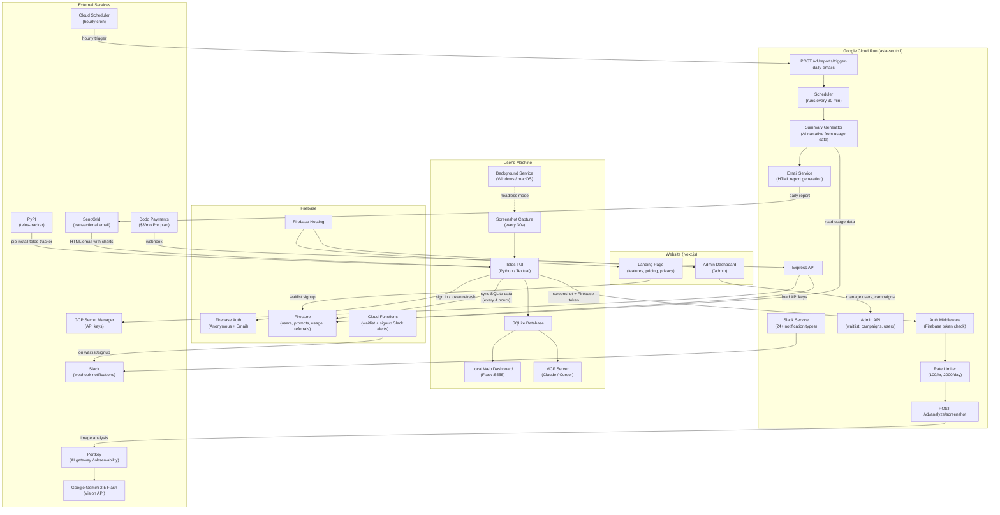

# System Architecture

## Overview

Telos is an AI-powered screen time tracker that captures screenshots, analyzes them with Gemini Vision AI, and provides productivity insights through a terminal UI.

## Monorepo Structure

```
telos/
├── client/          Python TUI desktop application (PyPI: telos-tracker)
├── backend/         Node.js Express API (Google Cloud Run)
├── website/         Next.js marketing site + admin dashboard (Firebase Hosting)
├── shared/          API contracts, types, constants
└── docs/            Architecture, deployment, decisions
```

## Tech Stack

| Component | Technology | Purpose |
|-----------|------------|---------|
| Client | Python 3.8+, Textual | Terminal UI, screenshot capture |
| Backend | Node.js 18+, Express | API server, Gemini proxy |
| Database | SQLite (client), Firestore (backend) | Local storage, cloud config |
| AI | Google Gemini 2.5 Flash | Screenshot analysis |
| Auth | Firebase Authentication | Anonymous + Email auth |
| Hosting | Google Cloud Run | Backend API hosting |
| Secrets | Google Secret Manager | API keys storage |
| Website | Next.js, Firebase Hosting | Waitlist landing page |

## System Diagram



## Data Flow (text)

```
1. Screenshot captured (every 30s)
   └── Perceptual hash computed
       └── Skip if duplicate of previous

2. Image sent to backend
   └── Rate limit checked (100/hr, 2000/day)
       └── Gemini Vision API called via Portkey

3. Response returned
   └── Category, app, task, confidence
       └── Stored in local SQLite

4. Session building (on-demand)
   └── Group similar activities
       └── AI enrichment (summary, learnings)

5. Firestore sync (every 4 hours)
   └── SQLite data pushed to Firestore
       └── Enables daily email reports

6. Daily email report (at user's preferred time)
   └── Cloud Scheduler triggers backend hourly
       └── Backend checks timezone, generates summary
           └── HTML email sent via SendGrid
```

## Key Components

### Client (`client/`)

| Directory | Purpose |
|-----------|---------|
| `core/` | Business logic (capture, analysis, database, sessions) |
| `tui/` | Terminal UI screens and widgets (Textual framework) |
| `utils/` | Helpers (config, prompts, logging) |
| `prompts/` | AI prompt templates (editable) |

**Key Files:**
- `main.py` - Entry point, CLI commands
- `core/analyzer.py` - Gemini API calls
- `core/backend_client.py` - Backend communication
- `core/database.py` - SQLite operations
- `tui/app.py` - Main TUI application

### Backend (`backend/`)

| Directory | Purpose |
|-----------|---------|
| `src/routes/` | API endpoints |
| `src/middleware/` | Auth, rate limiting, uploads |
| `src/services/` | Gemini, prompts, secrets |
| `src/config/` | Firebase initialization |

**Key Files:**
- `src/server.js` - Express app entry point
- `src/routes/analyze.js` - Screenshot analysis endpoint
- `src/services/gemini.js` - Gemini API client
- `src/middleware/auth.js` - Firebase token verification

### Shared (`shared/`)

- `api-contract.md` - API specification (source of truth)
- `constants.json` - Categories, colors, emojis
- `types.json` - JSON schemas for validation

## Authentication Flow

```
1. User launches app (first time)
   └── Firebase Anonymous Sign-in
       └── Get ID token + Refresh token
           └── Store in ~/.telos/auth.json

2. User makes API request
   └── Include ID token in Authorization header
       └── Backend verifies with Firebase Admin SDK
           └── Extract user UID for rate limiting

3. Token expires (1 hour)
   └── Client refreshes automatically
       └── New ID token stored
```

## Fallback Strategy

The client operates in three modes:

| Mode | When | Behavior |
|------|------|----------|
| Cloud | Backend healthy | Screenshots → Backend → Gemini |
| Local | Backend down | Screenshots → Local Gemini API |
| Offline | No internet | Skip analysis, log activity only |

Priority: Cloud > Local > Offline

## Security Model

| Concern | Solution |
|---------|----------|
| API keys | Stored in Secret Manager, never in code |
| User data | SQLite local-only, never uploaded |
| Screenshots | Analyzed in-memory, deleted immediately |
| Auth tokens | Firebase ID tokens, 1-hour expiry |
| Rate limiting | Per-user via Firestore tracking |

## Regional Deployment

- **Cloud Run**: `asia-south1` (Mumbai) - Low latency for Indian users
- **Firestore**: Co-located with Cloud Run
- **Secret Manager**: Same project, auto-fetched

